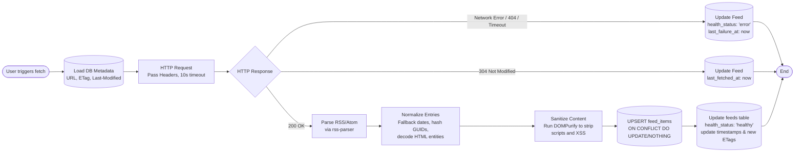

# Project Overview

All product documentation has been distilled into @plans/project-digest.md

Read this file for product context. Do not read /docs/ directly unless explicitly asked.

## Tech Stack

All libraries are already installed. Do not install anything without being explicitly asked.

| Category | Library |
| --- | --- |
| Framework | Next.js 16 |
| Database | PostgreSQL + Drizzle ORM |
| Auth | Better Auth |
| Design System | shadcn/ui |
| Styling | TailwindCSS v4 |
| Feed parsing | rss-parser |
| Content sanitization | DOMPurify + jsdom |
| Forms | React Hook Form |
| Validation | Zod |
| Async/server state | TanStack Query v5 |
| URL state | nuqs |
| Dates | date-fns |
| Icons | Lucide |

## Project Structure

Basic structure. It should be extended (include directories and files) as needed.

```bash
src/
├── app/
│   ├── page.tsx                    # landing page, no dashboard chrome
│   ├── (auth)/
│   │   ├── sign-in/page.tsx  
│   │   └── sign-up/page.tsx  
│   ├── (dashboard)/
│   │   ├── layout.tsx              # Sidebar + topbar chrome
│   │   ├── feed/page.tsx           # Main item list
│   │   └── saved/page.tsx          # Bookmarks
│   ├── reader/
│   │   ├── layout.tsx  
│   │   └── [itemId]/page.tsx       # In-app article view
│   └── api/
│       ├── auth/[...all]/route.ts  # Better Auth catch-all
│       └── feeds/route.ts          # Feed fetch + parse (server-side, CORS bypass)
│
├── components/
│   ├── ui/                       # shadcn primitives (untouched, auto-generated)
│   ├── layout/                   # Sidebar, Topbar, MobileDrawer
│   ├── feed/                     # FeedItem, FeedList, FeedCard, ItemSkeleton
│   ├── category/
│   ├── reader/                   # ArticleReader, ReaderNav
│   ├── providers/
│   └── shared/                   # GuestBanner, EmptyState, ErrorBoundary
│
├── db/
│   ├── index.ts                  # Drizzle client
│   └── schema.ts                 # Drizzle schema
|
├── lib/
│   ├── auth.ts                   # Better Auth configuration
│   ├── auth-client.ts            # Better Auth client
│   ├── feed/
│   │   ├── parser.ts             # rss-parser + fallback XML logic
│   │   ├── sanitizer.ts          # DOMPurify + jsdom pipeline
│   │   └── normalizer.ts         # Normalize dates, entities, missing fields
│   └── validations/              # Zod schemas shared by server + client
│
├── types/                        # Shared types
│
├── services/                     # business logic, orchestration user-scoped operations
│   ├── feed/
│   └── other/
|
├── actions/                      # Next.js Server Actions
│   ├── feed/
│   └── other/
│
├── hooks/                        # Custom reusable hooks
|
├── data/
│   └── guest-feeds.json          # 19 curated feeds, pre-fetched items
|
├── tests/
│   ├── setup.[ts,tsx]            # Vitest global hooks
│   ├── test-extend.tsx           # Vitest extends for DB isolation
│   ├── rtl-utils.tsx             # RTL custom render
│   └── mocks/                    # MSW setup
│
└── e2e/                          # Playwright tests
```

## Project conventions

### Components

- Default to Server Components. Push `"use client"` as deep as possible — never on layouts or pages unless unavoidable.
- All shadcn/ui components are already available for use, just import them.
- Never modify files in `components/ui/` — these are shadcn primitives managed by the CLI.
- Read a component's props interface before using it. Never guess and fix later.
- Bottom-up approach: Primitives -> Components -> Layout -> Page.

### State management

| State type | Tool |
| ---- | ---- |
| Server data, async fetching | TanStack Query |
| URL / shareable / filter state | nuqs |
| Client-only ephemeral state | useState |
| Cross-component client state | Context API |
| Form state | React Hook Form + Zod |

Never use TanStack Query for client-only state.
Never use Context API for server data.
Never use useState for URL state.

### Data fetching

- Call Server Actions directly or via `useTransition` for mutations
- Wrap Server Actions in `useMutation` when you need `isPending`, `onSuccess`, or `onError` callbacks
- Use TanStack Query `useQuery` with a Route Handler for all data fetching
- Never fetch inside `useEffect`
- Never call a Route Handler from a Server Component — fetch directly or use a shared lib function

#### Record and Replay

First call → fetch real feed → write to `/data/fixtures/<feed-id>.json`
Subsequent calls → read from fixture, skip network

### Actions

Server actions are responsible for:

- Input validation (Zod)
- Authentication (getSession)
- Authorization (ownership checks)
- Rate limiting on sensitive operations
- Delegating to services
- Cache revalidation (revalidatePath, revalidateTag)
- Catch at the boundary, mapping typed errors to response shapes
- Logging

Actions contain no business logic. If an action is doing more than coordinating the above, the logic belongs in a service.

### Error handling

- All custom error classes live in `lib/errors.ts`. Throw typed errors from services and fetcher functions. Catch and map them to response shapes in actions only. Never use string comparison on `error.message` to identify error types — always use `instanceof`.
- Each layer throws, only actions catch:
  - `lib/` — throw typed errors from `lib/errors.ts`, never catch
  - `services/` — throw typed errors, let lib errors propagate naturally
  - `actions/` — catch all errors, map to response shapes
- Never swallow errors in services or lib functions. Never return null to signal failure — throw instead. Never catch in a service unless you are rethrowing a more specific typed error.
- Server Actions return `{ success: true, data }` or `{ success: false, error: string, code: string }`
- Never expose internal error details, stack traces, or DB connection info in responses
- Never block a user flow on a non-critical failure (e.g. email delivery failure should not block sign-up)
- Always distinguish between validation errors (4xx) and server errors (5xx)

### Styling

- Tailwind CSS v4 utility classes only
- Never write custom CSS unless Tailwind cannot achieve the result
- Use `cn()` from `lib/utils.ts` for conditional class merging
- NEVER inline `dark:` for dark variants. The utilities respect the class (light or dark) applied on the root of the page.

### Drizzle Dependency Injection

Functions receive the Drizzle instance as parameter. Example:

```ts
import type { DB } from "@/db";
import { posts } from "@/db/schema";

export async function createPost(db: DB, title: string, content: string) {
  return await db.insert(posts).values({ title, content }).returning();
}
```

### Dev Session

Use `getCurrentSession()` exported from `src/lib/session.ts` to get a Better Auth session while no real authentication is built.

### Testing

The test suite is fully configured. Do not install or configure any test tooling.

You're allowed to extend the configuration if needed. For instance, include MSW handlers, fakes or wrappers in `/tests/rtl-utils`.

**Stack:**

- Vitest
- React Testing Library
- Mock Service Worker
- PGLite
- Playwright Test
- Better Auth Test Plugin

**Rules:**

1. Colocate every test file next to its implementation (e.g. `Button.test.tsx` beside `Button.tsx`).
2. Write new MSW handlers on demand in `/tests/mocks/` whenever required by the test. Do not add handlers speculatively.
3. Always use Playwright for testing Server Components and routing.
4. Use custom NPM scripts.
    - Vitest: `bun run test`
    - Playwright: `bun run test:e2e`

#### Integration Tests

- Import `test` from `@/tests/test-extend.ts`. This file extends Vitest with database cleanup logic. All other Vitest functions are globally available. Example:

  ```ts
  import { test } from "./test-extend";

  // This test's db operations are isolated
  test("inserts and rolls back correctly", async ({ tx }) => {
    // Injects db instance
    await createPost(tx, "Title", "Content");
    const posts = await tx.select().from(postsSchema);
    // No need to import `expect`, it's global
    expect(posts.length).toBe(1);
  });
  ```

- HTTP requests are intercepted by MSW.
- Always import from `/tests/rtl-utils.tsx` instead of directly from `@testing-library/react`.
- HTTP requests are intercepted by MSW.

#### E2E Tests

Use `@playwright/test` for all E2E and Server Component tests.

- Test files live in `/e2e/`
- Run with: `bun run test:e2e`
- Do not use Playwright MCP for test authoring
- Do not propose E2E tests for code that can be fully tested in Integration ones.

## Technical Decisions

### RSS Parsing & Data Normalization Constraints

When implementing the feed parser (`lib/feed/parser.ts` and `lib/feed/normalizer.ts`), you must adhere to the following defensive programming rules:

1. **Strict Timeouts:** All external feed requests must use `AbortController` with a strict 10-second timeout. Never let a slow feed hang a Server Action or Route Handler.
2. **Never Crash the UI:** If one feed out of 20 fails to parse, return a partial success array for the 19 valid feeds and log the error for the broken one. Never throw a global error that breaks the feed list view.
3. **Mandatory Sanitization:** All HTML content (`description`, `content`, `content:encoded`) MUST be passed through `DOMPurify` before hitting the database or the client. Strip all `<script>`, `<iframe>` (except standard video embeds), and `onload` handlers.
4. **Missing Data Fallbacks:**
   - If `pubDate` / `published` is missing or invalid, fallback to the current fetch timestamp (`new Date()`).
   - If `guid` / `id` is missing, generate a deterministic hash using the item's `url` + `title`.
   - If `title` is missing, fallback to "Untitled" or truncate the description.
5. **Entity Decoding:** Ensure HTML entities (e.g., `&amp;`, `&#8217;`) in titles and excerpts are properly decoded into strings before saving to the database.

### Feed Fetching

Feed fetching is entirely user-driven. Do not implement background polling, cron jobs, or setInterval hooks for refreshing feeds. Expose a Server Action/Route Handler for refreshing feeds that is only triggered via explicit user interaction (e.g., a 'Refresh' button).

### Ingestion Flow



### The Guest Experience & Data Fetching

- **For Guests (Unauthenticated)**: When the app detects no authenticated session, the data-fetching layer MUST intercept the request and fetch and return data exclusively from feeds available in `data/guest-feeds.json`. You MUST NOT execute any Drizzle database mutations or queries for guest sessions. Guest data is session-scoped and does not persist.

- **For New Users (Sign-Up)**: When a user successfully creates an account via the "Sign Up" flow, you MUST trigger a seed function. This function will read `data/guest-feeds.json`, fetch the live feeds, and insert the subscriptions and items into the database for that new user ID.
